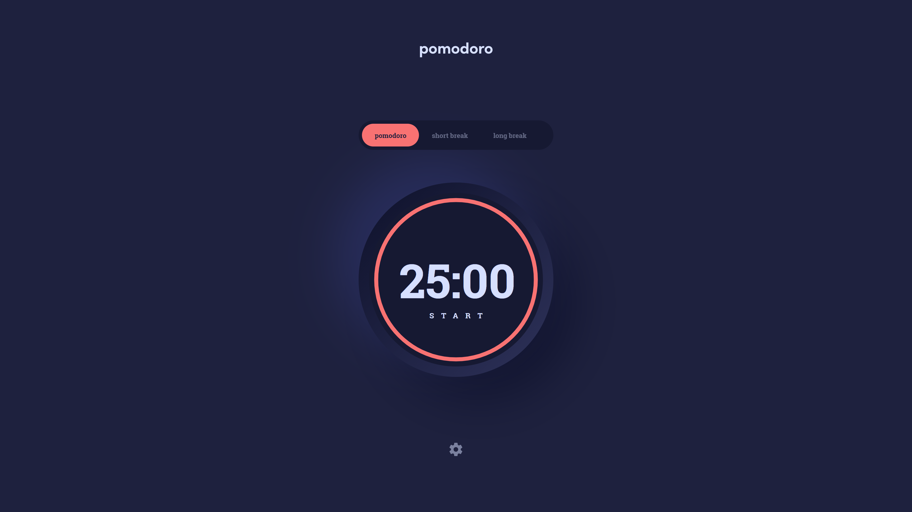

# Frontend Mentor - Pomodoro app solution

This is a solution to the [Pomodoro app challenge on Frontend Mentor](https://www.frontendmentor.io/challenges/pomodoro-app-KBFnycJ6G). Frontend Mentor challenges help you improve your coding skills by building realistic projects.

## Table of contents

- [Overview](#overview)
  - [The challenge](#the-challenge)
  - [Screenshot](#screenshot)
  - [Links](#links)
- [My process](#my-process)
  - [Built with](#built-with)
  - [What I learned](#what-i-learned)
  - [Useful resources](#useful-resources)
- [Author](#author)

## Overview

### The challenge

Users should be able to:

- Set a pomodoro timer and short & long break timers
- Customize how long each timer runs for
- See a circular progress bar that updates every minute and represents how far through their timer they are
- Customize the appearance of the app with the ability to set preferences for colors and fonts

### Screenshot

### Links

- [Live Site Preview](https://mieszkokowalik-pomodoro.netlify.app/)

## My process

### Built with

- Semantic HTML5 markup
- SCSS
- BEM methodolgy
- Mobile-first workflow
- CSS custom properties
- Flexbox
- Grid
- JavaScript
- Webpack
- LocalStorage
- Notifiactions API

### What I learned

For the whole build I used Webpack module bundler. At first it's a chalange to configure it properly, but later on makes building you project much better and easier.

I have hosted the fonts by my own, instead of using google fonts.

There are couple additional features that were not included in original challange:

- Users prefferences are saved in local storage. This means that you don't have to change your theme and timer settings every time you open this website
- Audio played at the start and end of the timer
- Notification displayed when the countdown has ended

### Useful resources

- [Webpack](https://webpack.js.org/guides/)
- [SVG Progress bar - Codepen](https://codepen.io/web-tiki/pen/qEGvMN) - This codepen gave me a pretty good idea about how to make the round progress bar.
- [SASS - File Architecture](https://sass-guidelin.es/#architecture)

## Author

- Frontend Mentor - [@MieszkoKowalik](https://www.frontendmentor.io/profile/MieszkoKowalik)
